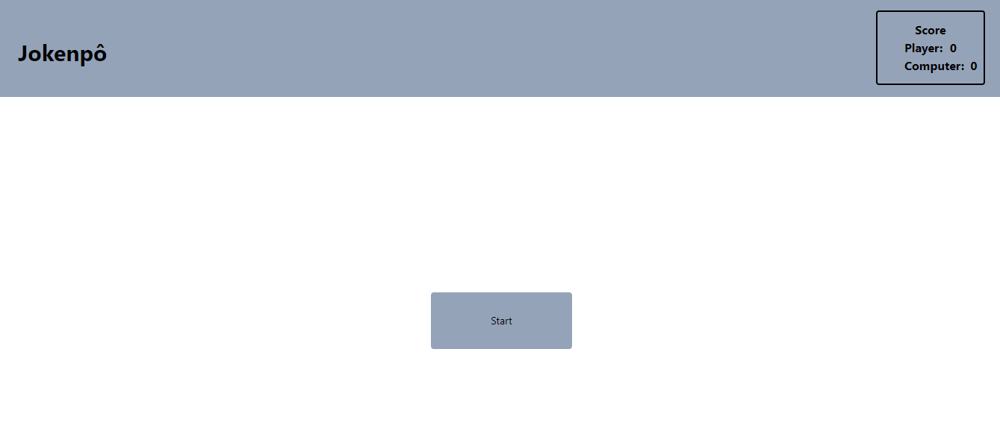
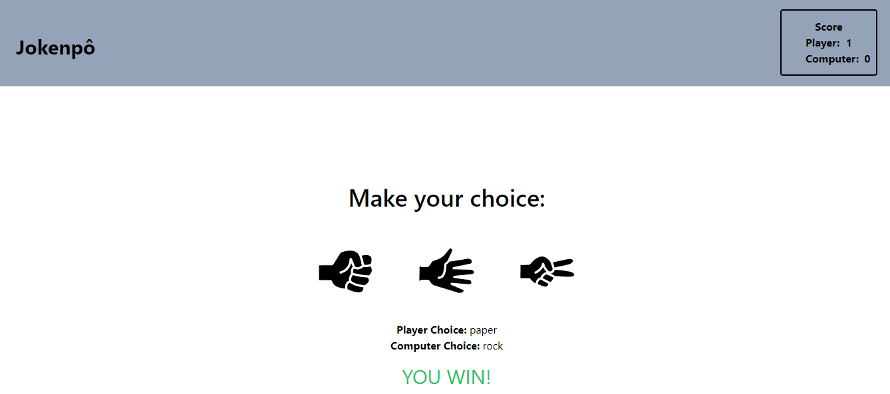
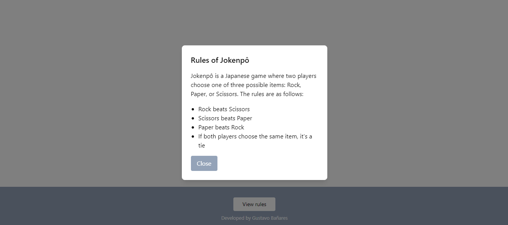

# Rock-Paper-Scissors

Explore a digital version of the classic game Rock, Paper, Scissors! This project was developed with the aim of practicing web development skills and offering a fun experience for players.

## Features

- User can select Rock, Paper, or Scissors.
- The computer randomly selects Rock, Paper, or Scissors.
- The game determines the winner based on standard rules:
- Rock beats Scissors
- Scissors beats Paper
- Paper beats Rock
- Score tracking to see how well you fare against the computer.
- Clean and user-friendly interface.
  
## Technologies Used

This project was built using the following technologies:

- React: For creating the user interface and managing game state.
- Tailwind CSS: Styling and responsive design.
- JavaScript: Game logic and interactivity.

## Image

- Main:
  
- Game:
  
  - Game:
  

## Installation

To get a local copy up and running, follow these simple steps:

1. Clone the repository:
  ```bash
  git clone https://github.com/gustavobanares/Rock-Paper-Scissors.git
```
2. Navigate to the project directory:
```bash
cd rock-paper-scissors
```
3. Install the dependencies:
```bash
npm install
```
4. Start the development server:
```bash
npm start
```
5. Open http://localhost:3000 in your browser to play the game.

## Project Link

Deployed: https://rock-paper-scissors-2-0.vercel.app/

## License

This project is licensed under the [MIT License](https://choosealicense.com/licenses/mit/) see the LICENSE file for details.

